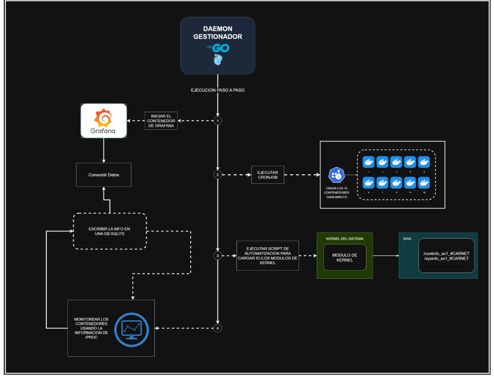

# Documentación del Proyecto SO1 – Monitor de Contenedores y Procesos

## Arquitectura


##  Estructura del Módulo
```
proyecto-2/

├── kernel-modules/
│ ├── mod_sys/ # Módulo de procesos generales
│ │ ├── mod_sysinfo.c
│ │ ├── Makefile
│ ├── mod_cont/ # Módulo de procesos de contenedores
│ │ ├── mod_continfo.c
│ │ ├── Makefile
│ ├── build_all.sh # Script de compilación de todos los módulos
```


- **mod_sysinfo.c** → expone información de RAM y procesos del sistema en `/proc/sysinfo_so1_202000774`.  
- **continfo.c** → expone información de procesos que corren dentro de contenedores en `/proc/continfo_so1_202000774`.  
- **Makefile** → automatiza la compilación de cada módulo.  
- **build_all.sh** → script auxiliar para compilar todos los módulos.  

---

## ⚙️ Funciones principales y propósito

### En `mod_sysinfo.c`
- `sysinfo_show()` → recopila RAM total, libre y usada + lista procesos generales del sistema.  
- `sysinfo_open()` → prepara la lectura secuencial desde `/proc`.  
- `sysinfo_init()` → registra el archivo `/proc/sysinfo_so1_<CARNET>`.  
- `sysinfo_exit()` → elimina el archivo `/proc` al descargar el módulo.  

### En `continfo.c`
- `is_task_in_container()` → heurística para decidir si un proceso pertenece a un contenedor (basado en namespaces).  
- `print_task_info()` → imprime métricas de cada proceso (PID, memoria, CPU, estado, comando).  
- `continfo_show()` → recorre procesos y filtra solo los de contenedores.  
- `continfo_open()`, `continfo_init()`, `continfo_exit()` → equivalentes al módulo de sysinfo.  

---

## 📦 Dependencias externas
- **Kernel headers** (`linux-headers-$(uname -r)`) para compilar módulos.  
- Herramientas de compilación (`make`, `gcc`).  
- Soporte de **cgroups** y **namespaces** (ya incluidos en kernels modernos).  

---

##  Compilación del Módulo
1. Ir al directorio del módulo:  
   ```bash
   cd proyecto-2/kernel-modules/mod_sys
    ```
2. Ejecutar make:

    ```bash
    make
    ```
3. Esto genera el archivo mod_sysinfo.ko.

4. Repetir para el módulo de contenedores:
    ```bash
    cd ../mod_cont
    make
    ```

##  Carga y Descarga del Módulo

* Cargar módulo:
    ```bash
    sudo insmod mod_sysinfo.ko
    sudo insmod mod_continfo.ko
    ```

* Descargar módulo:
    ```bash
    sudo rmmod mod_sysinfo
    sudo rmmod mod_continfo
    ```

* Verificar carga correcta:
    ```bash
    lsmod | grep sysinfo
    lsmod | grep continfo
    dmesg | tail -n 10
    ```

## ✅ Pruebas y Verificación

* Leer procesos del sistema:
    ```bash
    cat /proc/sysinfo_so1_202000774
    ```

* Leer procesos de contenedores:
    ```bash
    cat /proc/continfo_so1_<CARNET>
    ```

##  Decisiones de Diseño y Problemas

- Uso de /proc → se eligió /proc porque es el estándar para exponer información de kernel hacia espacio de usuario.

- Contenedores → se usaron namespaces (task->nsproxy->pid_ns_for_children) para detectar procesos de contenedores, ya que es portable sin depender de Docker directamente.

- Unidades de memoria en MB → se decidió mostrar memoria en MB en lugar de KB para mayor legibilidad.

- Problema encontrado → en kernels modernos, struct proc_ops reemplaza struct file_operations para /proc. Solución: actualizar el código a proc_ops.

- Problema con task->state → ahora se usa task_state_to_char(task) en lugar de acceder directamente a task->state.

##  Estructura del Daemon en Go


### Funciones principales

- readProcFiles() → lee /proc/sysinfo_so1_<CARNET> y /proc/continfo_so1_<CARNET>.

- storeInSQLite() → inserta métricas en la base de datos containers.db.

- monitorAndDecide() → aplica reglas (ejemplo: eliminar contenedor si supera 80% de RAM).

- deleteContainer() → ejecuta docker rm -f sobre el contenedor ofensivo.

- runDaemon() → bucle principal que corre en segundo plano y coordina las funciones anteriores.

