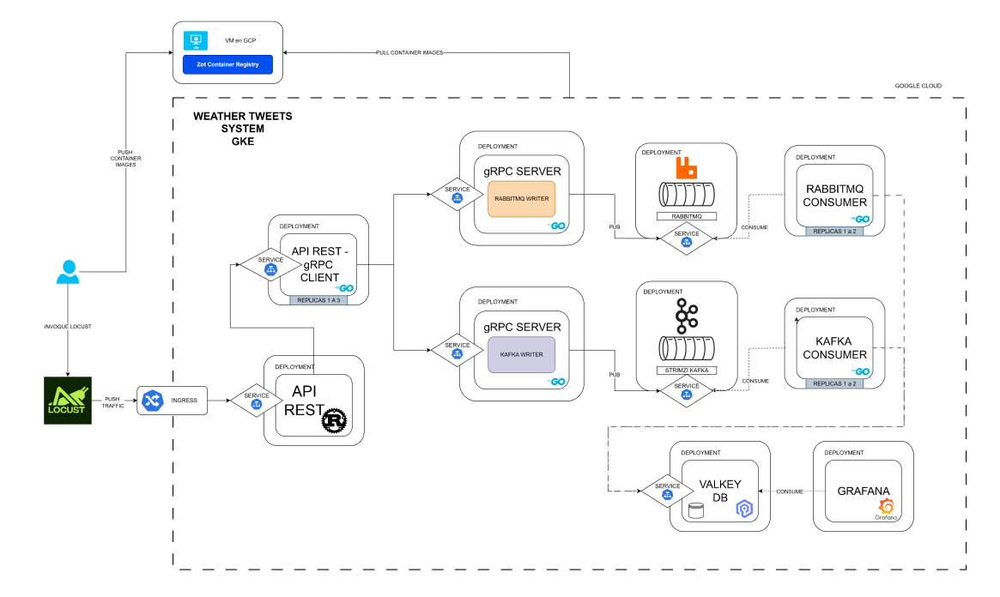

# 🌤️ Proyecto 3 — Weather Tweets System (GKE)

**Curso:** Sistemas Operativos 1  
**Universidad de San Carlos de Guatemala**  
**Estudiante:** Gerson David Otoniel Gonzalez Morales  
**Carnet:** 202000774  
**Período:** 2S 2025  

---

## 1. Descripción del Proyecto

El proyecto **“Weather Tweets System”** implementa una arquitectura de **microservicios distribuidos y escalables** en **Google Cloud Platform (GCP)** utilizando **Google Kubernetes Engine (GKE)**.  
El sistema simula el flujo completo de procesamiento de "tweets" sobre el clima local, desde la generación de tráfico hasta la visualización de métricas en Grafana.

El objetivo principal es aplicar los conocimientos de **contenedores, concurrencia, mensajería asíncrona, almacenamiento en memoria y visualización de datos**, comparando el rendimiento de tecnologías clave como **Kafka, RabbitMQ y Valkey**.

---

## 2. Arquitectura General del Sistema



**Componentes principales:**

| Componente | Lenguaje | Descripción |
|-------------|-----------|-------------|
| **Locust** | Python | Genera tráfico simulando usuarios enviando tweets del clima. |
| **Ingress NGINX** | - | Distribuye las peticiones HTTP hacia la API REST. |
| **API REST** | Rust | Recibe peticiones JSON, transforma los datos y llama a los servicios gRPC. |
| **gRPC Servers** | Go | Publican mensajes hacia los brokers (Kafka / RabbitMQ). |
| **Kafka / RabbitMQ** | - | Transmiten mensajes de forma asíncrona entre productores y consumidores. |
| **Consumers (Go)** | Go | Procesan mensajes y los guardan en la base de datos en memoria Valkey. |
| **Valkey DB** | - | Base de datos en memoria para almacenamiento rápido de métricas climáticas. |
| **Grafana** | - | Visualiza los datos de Valkey mediante dashboards personalizados. |
| **Zot Registry** | - | Registro privado para almacenar y distribuir las imágenes Docker. |

---

## 3. Flujo de Datos

1. **Locust** genera solicitudes HTTP al endpoint `/api/tweet` del **Ingress Controller**.
2. **NGINX** las enruta hacia el **Deployment `api-rest`** (Rust).
3. La API REST actúa como cliente **gRPC**, enviando cada tweet a uno de los servidores:
   - `grpc-server-kafka`
   - `grpc-server-rabbit`
4. Cada gRPC server **publica el mensaje** en su respectivo broker (Kafka o RabbitMQ).
5. Los **consumidores** (`kafka-consumer` y `rabbit-consumer`) leen los mensajes,
   procesan la información y la guardan en **Valkey**.
6. **Grafana** obtiene los datos de Valkey para mostrarlos en dashboards.

---

##  4. Componentes y Tecnologías

| Tecnología | Rol |
|-------------|-----|
| **Rust (Actix, Tokio)** | API REST concurrente. |
| **Go (gRPC, Sarama, AMQP, Redis)** | Servicios gRPC, publishers y consumers. |
| **Kafka (Bitnami Helm)** | Broker de mensajes 1. |
| **RabbitMQ (Bitnami Helm)** | Broker de mensajes 2. |
| **Valkey (Redis compatible)** | Base de datos en memoria. |
| **Grafana (Helm)** | Visualización de métricas. |
| **Locust (Python)** | Generador de tráfico. |
| **Kubernetes (GKE)** | Orquestación de contenedores. |
| **Zot** | Registro privado de imágenes Docker. |

---

##  5. Estructura del Repositorio
```
proyecto3/
├── README.md
├── proto/weather.proto
├── locust/locustfile.py
├── api_rust/
│ ├── src/main.rs
│ └── Dockerfile
├── grpc_server_kafka/
│ ├── main.go
│ └── Dockerfile
├── grpc_server_rabbit/
│ ├── main.go
│ └── Dockerfile
├── kafka_consumer/
│ ├── main.go
│ └── Dockerfile
├── rabbit_consumer/
│ ├── main.go
│ └── Dockerfile
├── manifests/
│ ├── api-rest.yaml
│ ├── grpc-server-kafka.yaml
│ ├── grpc-server-rabbit.yaml
│ ├── kafka-consumer.yaml
│ ├── rabbit-consumer.yaml
│ ├── valkey-statefulset.yaml
│ ├── ingress.yaml
│ ├── configmap.yaml
│ ├── ns.yaml
│ └── hpa-api.yaml
└── scripts/
├── build_push.sh
└── deploy_all.sh
```

---

##  6. Contenerización y Zot Registry

1. Ejecutar Zot en una VM de GCP:
   ```bash
   docker run -d --name zot -p 5000:5000 ghcr.io/project-zot/zot-linux-amd64:latest
   Acceder vía navegador: http://[IP_VM]:5000

2. Construir y subir imágenes:

```
bash scripts/build_push.sh


Verificar que las imágenes se encuentren disponibles en el registry:

[IP_VM]:5000/api_rust:latest
[IP_VM]:5000/grpc_server_kafka:latest
```

 7. Despliegue en Kubernetes (GKE)

7.1 Crear el clúster
gcloud container clusters create weather-tweets-gke \
  --region us-central1 \
  --num-nodes 3 \
  --machine-type e2-medium \
  --enable-ip-alias

7.2 Conectarse al clúster
gcloud container clusters get-credentials weather-tweets-gke --region us-central1

7.3 Instalar dependencias con Helm
# Ingress NGINX
```
helm repo add ingress-nginx https://kubernetes.github.io/ingress-nginx
helm install nginx-ingress ingress-nginx/ingress-nginx
```
# Kafka
```
helm repo add bitnami https://charts.bitnami.com/bitnami
helm install my-kafka bitnami/kafka
```
# RabbitMQ
```
helm install my-rabbit bitnami/rabbitmq
```
# Grafana
```
helm repo add grafana https://grafana.github.io/helm-charts
helm install grafana grafana/grafana -n weather --create-namespace
```
7.4 Desplegar componentes del proyecto
```
bash scripts/deploy_all.sh
```
7.5 Verificar pods en ejecución
```
kubectl get pods -n weather
```
8. Horizontal Pod Autoscaler (HPA)

El HPA permite escalar el número de pods del servicio API REST automáticamente según la carga.
```
kubectl apply -f manifests/hpa-api.yaml -n weather
kubectl get hpa -n weather
```

Durante la evaluación se mostrará el escalado dinámico al aumentar tráfico con Locust.

9. Generación de carga con Locust

Ejecutar Locust localmente:
```
cd locust
locust -f locustfile.py --host=http://[IP_INGRESS]
```

Abrir interfaz web: http://localhost:8089

Configurar:

Usuarios: 50

Rate de spawn: 10/s

Duración: 1-3 minutos

Locust enviará peticiones con estructura JSON:
```
{
  "municipality": "mixco",
  "temperature": 25,
  "humidity": 70,
  "weather": "sunny"
}
```
 10. Visualización con Grafana

Conectar Grafana al datasource Valkey (Redis compatible):

Instalar el plugin:
```
kubectl set env deploy/grafana -n weather GF_INSTALL_PLUGINS=grafana-redis-datasource
```

Crear un nuevo datasource Redis → valkey:6379.

Crear un dashboard con los siguientes paneles:

###  Paneles del Dashboard de Grafana

| **Panel** | **Descripción** |
|------------|----------------|
| **Temperatura más alta / más baja** | Valores extremos registrados. |
| **Humedad promedio por municipio** | Promedio de humedad acumulada. |
| **Temperatura promedio por municipio** | Media de temperatura por ubicación. |
| **Total de reportes por condición climática** | Conteo de tweets por tipo de clima. |
| **Sección personalizada por carnet** | Datos y series del municipio asignado. |

**Municipio asignado según último dígito del carnet:**

| Dígito final del carnet | Municipio asignado |
|--------------------------|--------------------|
| 0–2 | Mixco |
| 3–5 | Guatemala |
| 6–7 | Amatitlán |
| 8–9 | Chinautla |

---

###  11. Comparativas de Rendimiento

#### Kafka vs RabbitMQ

| **Criterio** | **Kafka** | **RabbitMQ** |
|---------------|------------|---------------|
| **Throughput** | Más alto con mensajes grandes. | Más estable en tráfico irregular. |
| **Latencia** | Ligera ventaja en grandes lotes. | Responde más rápido en cargas pequeñas. |
| **Persistencia** | Alta, segmentada en discos. | Ligera penalización en escritura. |
| **Escalabilidad** | Mejor con múltiples particiones. | Limitado por número de colas. |

**Conclusión:**  
Kafka fue más eficiente para transmisión de gran volumen continuo;  
RabbitMQ fue más confiable para mensajes pequeños y consistencia en el orden.

---

#### Valkey con réplicas

- Con **1 réplica** → menor latencia (~1 ms promedio).  
- Con **2 réplicas** → mejora la disponibilidad, con impacto mínimo en tiempos de escritura.

---

#### HPA activado

- El **API REST** escaló de 1 → 3 pods al superar **30 % de uso de CPU**.  
- **Kafka** absorbió mejor la carga bajo presión, mientras **RabbitMQ** mostró más reintentos.

---

###  12. Buenas Prácticas Aplicadas

- Uso de **ConfigMap** para centralizar variables de entorno.  
- **StatefulSet** para persistencia y replicación de Valkey.  
- Imágenes ligeras con **multi-stage builds** (Rust y Go).  
- Separación por **namespaces (`weather`)** en Kubernetes.  
- Escalabilidad con **HPA** (demostración en vivo).  
- Control de recursos mediante `requests` y `limits`.

---

###  13. Retos y Soluciones

| **Reto** | **Solución** |
|-----------|--------------|
| Diferencias entre gRPC y HTTP | Se implementó conversión JSON → Protobuf y canal binario. |
| Errores de conexión con brokers | Se aplicó *retry* automático en los *publishers* Go. |
| Sin persistencia en Redis/Valkey | Se configuró `appendonly yes` y dos réplicas. |
| Escalado desigual de pods | Ajuste de `requests.cpu` para equilibrar métricas del HPA. |
| Límite de almacenamiento en Zot | Rotación de imágenes y limpieza con `docker image prune`. |

---

### 14. Instrucciones de Ejecucion rapida
# 1. Iniciar Zot Registry
```
docker run -d -p 5000:5000 ghcr.io/project-zot/zot-linux-amd64:latest
```
# 2. Construir y subir imágenes
```
bash scripts/build_push.sh
```
# 3. Desplegar cluster
```
bash scripts/deploy_all.sh
```
# 4. (Durante evaluación) Aplicar HPA
```
kubectl apply -f manifests/hpa-api.yaml -n weather
```
# 5. Ejecutar Locust
```
locust -f locust/locustfile.py --host=http://<IP_INGRESS>
```
# 6. Acceder a Grafana
```
kubectl port-forward svc/grafana 3000:80 -n weather
```

### 15. Conclusiones

- Se logró implementar un **sistema distribuido escalable** utilizando tecnologías modernas en la nube.  
- **Rust** demostró excelente rendimiento en la API REST bajo carga concurrente.  
- **Go + gRPC** ofrecieron comunicación binaria eficiente y estable entre servicios.  
- **Kafka** superó a **RabbitMQ** en *throughput*, mientras **RabbitMQ** destacó en latencia baja.  
- **Valkey**, como base en memoria, ofreció tiempos de respuesta submilisegundos y alta disponibilidad.  
- El sistema se adaptó dinámicamente al tráfico mediante **HPA**, validando la escalabilidad automática de **Kubernetes**.

---

###  16. Futuras Mejoras
- Implementar **métricas de Prometheus** para cada microservicio.  
- Integrar **almacenamiento persistente (PostgreSQL)** para históricos.  
- Añadir **VPA (Vertical Pod Autoscaler)** para optimizar recursos.  
- Mejorar las **visualizaciones en Grafana** con alertas y umbrales de temperatura.  
- Agregar **servicio de autenticación** para futuras extensiones multiusuario.  

---
